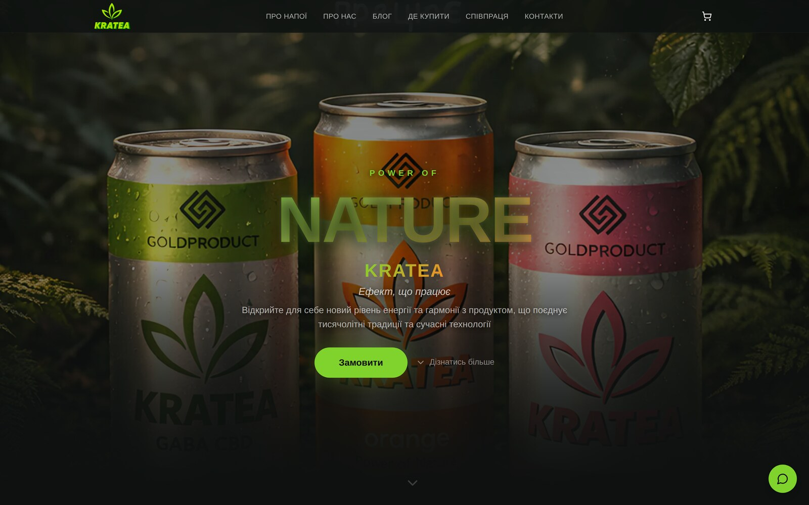
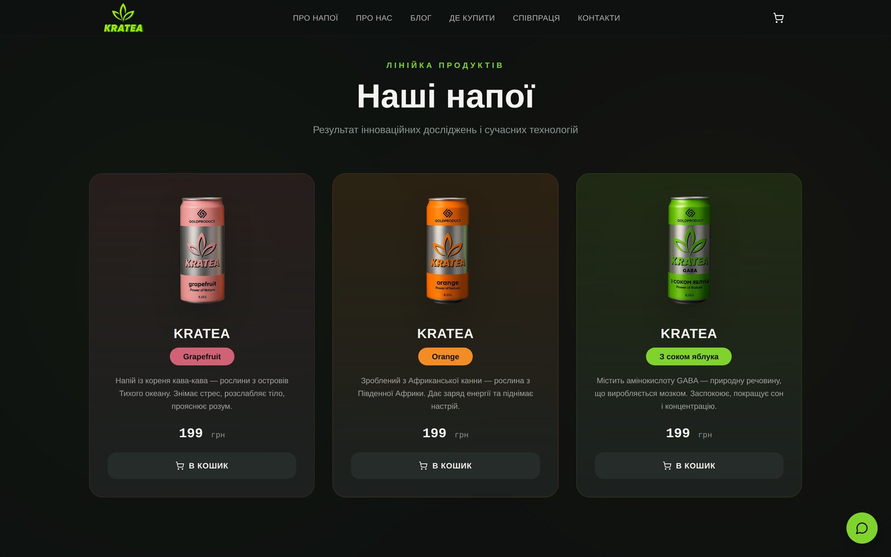
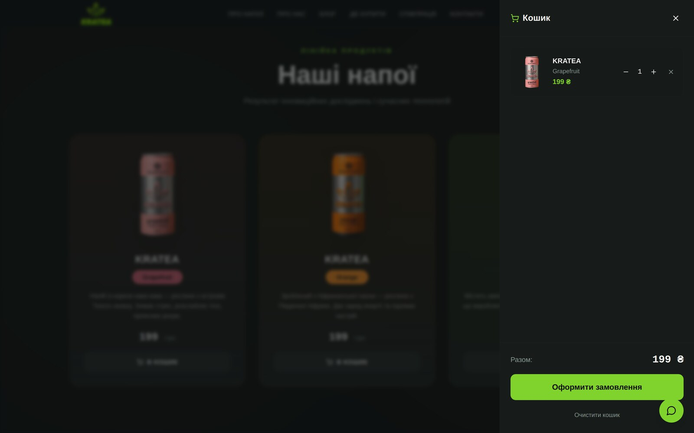
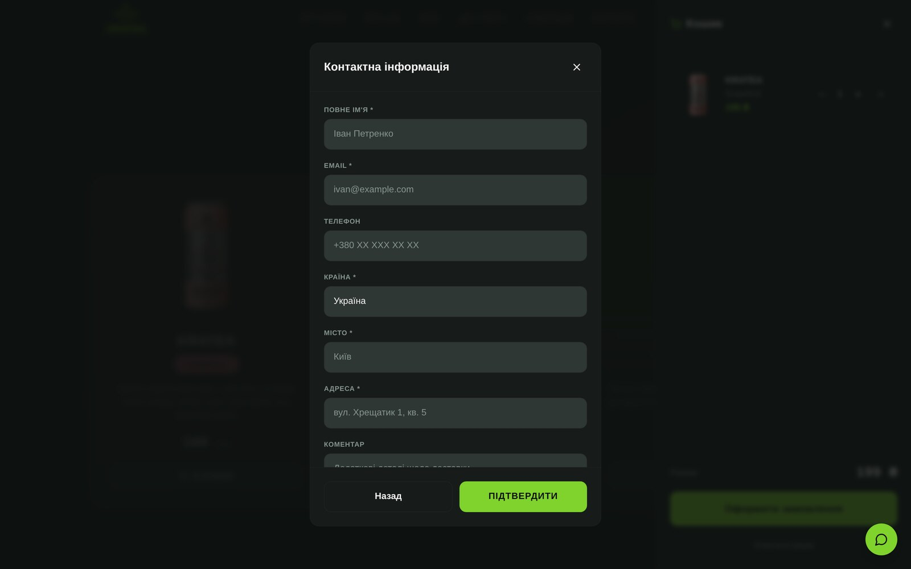
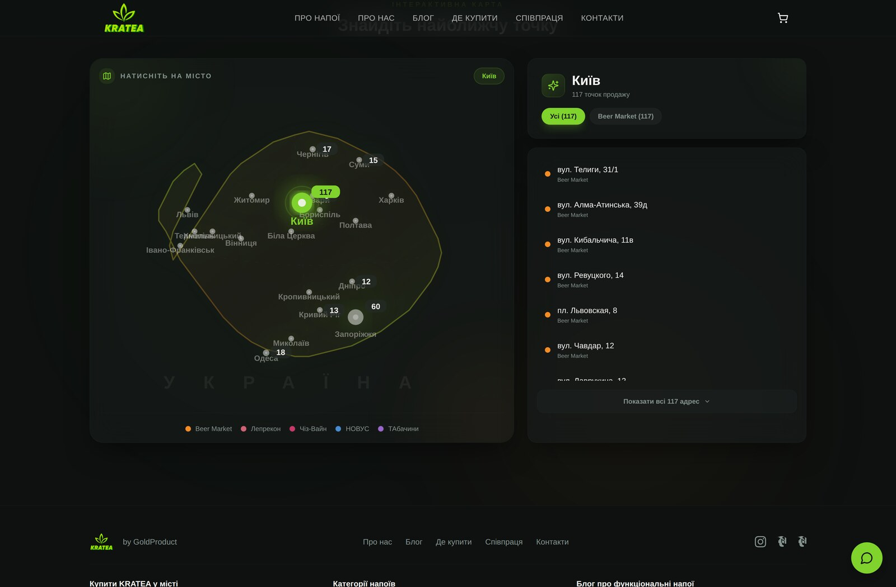
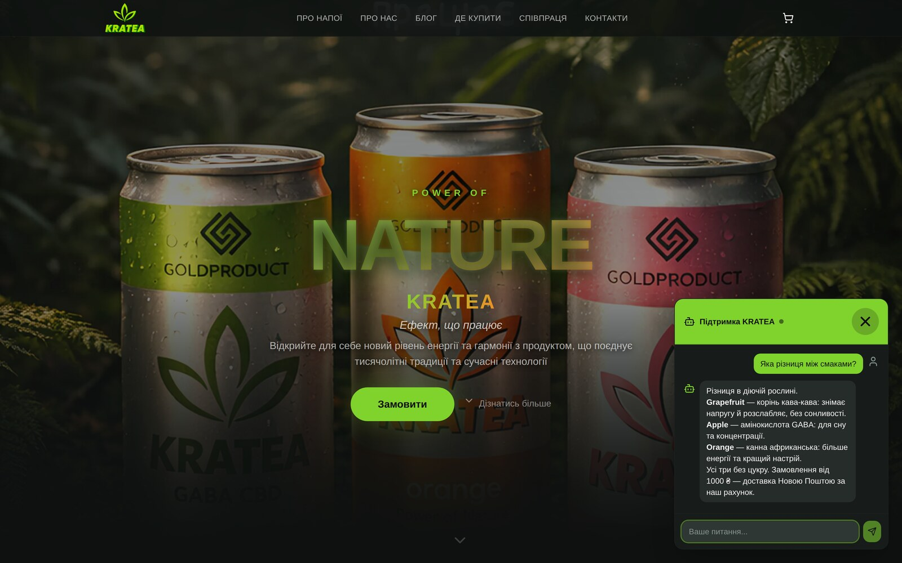
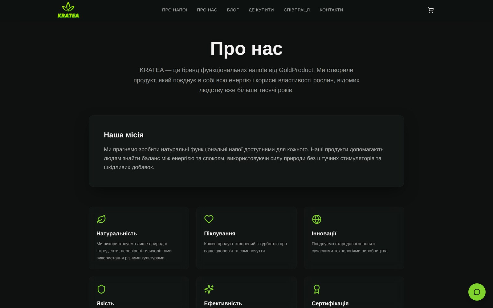
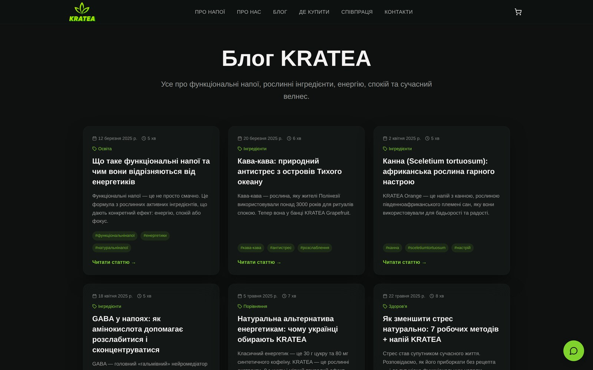

<div align="center">

<h1>KRATEA</h1>

<p><strong>Ukrainian storefront for GABA + CBD functional drinks.</strong><br>
React 18 · Vite · Tailwind · shadcn/ui · Supabase — with cart, checkout, Telegram order notifications and an admin panel.</p>

<p>
  <a href="LICENSE"></a>
  
  
  
  
  <a href="../../actions/workflows/ci.yml"></a>
</p>

</div>



---

## What this is

A production storefront, not a template. Seven pages of Ukrainian content, a cart that survives navigation,
a checkout that writes to Postgres and pings Telegram, a store locator covering real retail chains, and an
admin panel behind a server-side secret.

The interesting parts are the ones a template usually skips: **row-level security that actually denies
reads**, order notifications through an edge function so no token ever reaches the browser, and a
prerender step that emits 22 static HTML files for SEO without adopting a meta-framework.

## Screens

### The product line

Three cans, three plants, one price. Prices, copy and imagery are typed static data — no database
needed to browse.



### Cart and checkout

The drawer keeps its contents across navigation. Checkout writes to Supabase `orders` and triggers a
Telegram notification through an edge function, so the bot token never reaches the browser.

<table>
<tr>
<td width="50%"></td>
<td width="50%"></td>
</tr>
<tr>
<td align="center"><em>Cart — quantity stepper, live total</em></td>
<td align="center"><em>Checkout — validated, writes to Postgres</em></td>
</tr>
</table>

### Store locator

A hand-drawn SVG map of Ukraine — no tile provider, no API key, no third-party request. Circle size
scales with the number of stockists; clicking a city filters the address list beside it by retail
chain. All of it from typed static data, with the counts derived rather than hardcoded.



### Support chat

A floating assistant backed by the `customer-support` edge function, which streams from any
OpenAI-compatible gateway. Replies render as Markdown, and the API key stays server-side. The whole
feature is off unless you set `AI_API_KEY`.



### The rest

<table>
<tr>
<td width="50%"></td>
<td width="50%"></td>
</tr>
<tr>
<td align="center"><em>About — brand story and production process</em></td>
<td align="center"><em>Blog — static posts, prerendered to HTML</em></td>
</tr>
</table>

## Features

| | |
|---|---|
| **Cart** | React context, quantity merging, a zero-quantity guard that removes the line rather than leaving a ghost item. Covered by unit tests. |
| **Checkout** | Writes to Supabase `orders`, then triggers a Telegram notification through an edge function — the bot token never reaches the client. |
| **Admin panel** | Order list and status updates, served by the `admin-orders` edge function running with the service-role key behind `ADMIN_SECRET_KEY`. |
| **Store locator** | A hand-drawn SVG map of Ukraine — no tile provider, no API key, no third-party request. Circle size scales with stockist count; clicking a city filters the address list by retail chain. |
| **Blog** | Static posts with per-post routes, prerendered to HTML. |
| **Support chat** *(optional)* | A floating assistant streaming from any OpenAI-compatible gateway through an edge function, so the API key never reaches the browser. Replies render as Markdown. Off unless you set `AI_API_KEY`. |
| **Marketing copy** *(optional)* | Generates product and campaign copy from the admin panel, through the same gateway. |
| **SEO** | 22 prerendered pages, per-page meta, JSON-LD `Organization` and `LocalBusiness`. |

## Stack

| Layer | Choice |
|---|---|
| Build | Vite 5 + `@vitejs/plugin-react-swc` |
| UI | React 18, Tailwind CSS, shadcn/ui (Radix) |
| Routing | React Router |
| Backend | Supabase — Postgres, RLS, Deno edge functions |
| Tests | Vitest + Testing Library (unit), Playwright (e2e) |
| Prerender | `scripts/prerender.ts` |

## Quick start

```bash
git clone https://github.com/STALK37/Kratea.git
cd Kratea
npm install
cp .env.example .env
npm run dev            # http://localhost:8080
```

The site renders immediately. Cart and checkout need Supabase — **[SETUP.md](SETUP.md)** walks through it
in about 15 minutes.

| Script | Does |
|---|---|
| `npm run dev` | Vite dev server |
| `npm run build` | Production build + prerender to `dist/` |
| `npm run preview` | Serve the built site |
| `npm test` | Vitest unit tests |
| `npm run test:coverage` | Unit tests with coverage |
| `npm run typecheck` | `tsc --noEmit` |
| `npm run lint` | ESLint |
| `npx playwright test` | End-to-end suite |

Node 20+.

## Tests

**Unit** — `src/test/CartContext.test.tsx` covers the cart: adding, quantity merging, explicit quantity
updates, removal, totals, and the zero-quantity regression guard.

```bash
npm test
```

**End-to-end** — `e2e/storefront.spec.ts` builds the site, serves it, and checks the hero renders, every
top-level route responds, unknown routes hit the 404 page, and **no image on the home page is broken** —
that last one catches the most common way a static build silently degrades.

```bash
npx playwright install chromium   # first run only
npx playwright test
```

## Project structure

```
src/
├─ pages/            # one file per route
├─ components/       # Header, HeroSection, ProductCard, CheckoutDialog…
│  └─ ui/            # shadcn/ui primitives
├─ context/
│  └─ CartContext.tsx
├─ data/             # storeData, blogPosts, landingPages — typed static content
├─ integrations/
│  └─ supabase/      # client + generated types
└─ lib/orders.ts     # order submission
supabase/
├─ migrations/       # schema history, apply in order
└─ functions/        # telegram-order-notify · admin-orders · customer-support · marketing-ai
scripts/prerender.ts # emits static HTML per route
e2e/                 # Playwright specs
```

## Configuration

Everything environment-specific is in `.env` (see `.env.example`). Server-side secrets — Telegram token,
admin key, AI key — are Supabase function secrets and never appear in the bundle. Details in
[SETUP.md](SETUP.md).

> [!NOTE]
> Contact details in `src/pages/ContactPage.tsx` and `WhereToBuyPage.tsx` are placeholders. Replace them
> with your own before deploying.

## Contributing

See [CONTRIBUTING.md](CONTRIBUTING.md). Security reports: [SECURITY.md](SECURITY.md) — please don't open a
public issue for those.

## License

[MIT](LICENSE)
