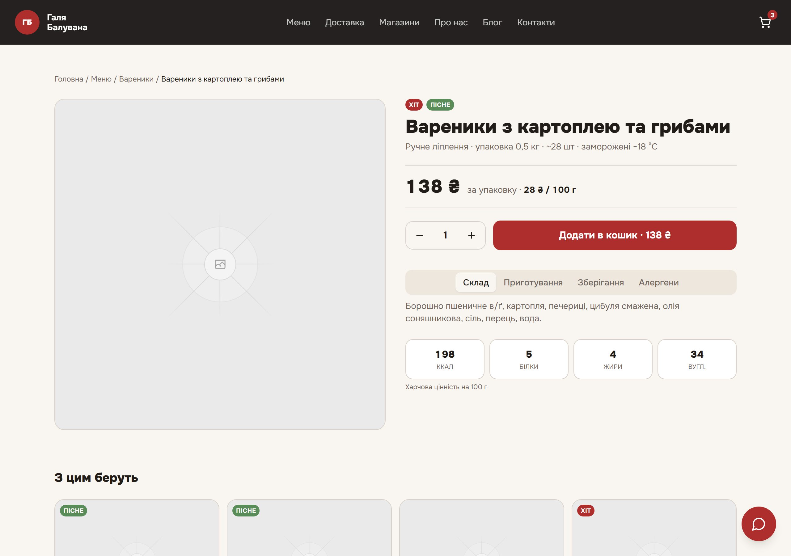
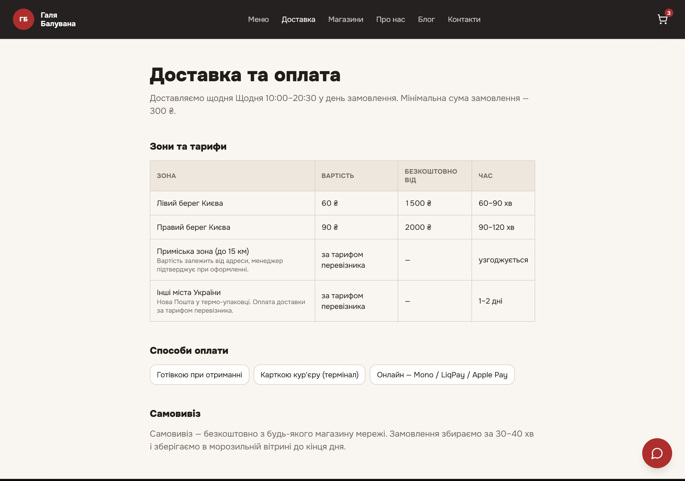

<div align="center">

<h1>Галя Балувана</h1>

<p><strong>Вітрина магазину домашніх напівфабрикатів ручного ліплення.</strong><br>
React 18 · Vite · Tailwind · shadcn/ui · Supabase — каталог, кошик, оформлення з
доставкою або самовивозом, сповіщення про замовлення в Telegram і адмін-панель.</p>

<p>
  <a href="LICENSE"></a>
  
  
  
  
  <a href="../../actions/workflows/ci.yml"></a>
</p>

</div>


---

## Що це

Робоча вітрина, а не шаблон. Меню з 8 категорій і 35 позицій, кошик, що переживає
перезавантаження сторінки, оформлення з вибором доставки чи самовивозу, часовим слотом
і способом оплати, карта магазинів по Україні та адмін-панель за серверним секретом.

Цікаве тут — те, що шаблони зазвичай пропускають: **row-level security, яка справді
забороняє читання замовлень**, сповіщення через edge-функцію, тому токен бота ніколи не
потрапляє в браузер, і крок prerender, який видає ~60 статичних HTML-сторінок для SEO без
меж-фреймворка.

## Екрани

### Меню й товар

Вісім категорій, 35 позицій — типізовані статичні дані, база для перегляду не потрібна.
Ціна показується за упаковку і за 100 г. На сторінці товару — склад, КБЖУ, спосіб
приготування, зберігання, алергени та блок «з цим беруть».

<table>
<tr>
<td width="50%"></td>
<td width="50%"></td>
</tr>
<tr>
<td align="center"><em>Меню — ціна за упаковку і за 100 г, мітки</em></td>
<td align="center"><em>Товар — вкладки складу, КБЖУ, лічильник</em></td>
</tr>
</table>

### Кошик і оформлення

Кошик зберігається в `localStorage` і переживає навігацію. Оформлення підтримує доставку
й самовивіз: зона й адреса або вибір магазину, дата й часовий слот, спосіб оплати.
Сабміт пише в Supabase `orders` і тригерить сповіщення в Telegram через edge-функцію,
тому токен бота не доходить до клієнта.

<table>
<tr>
<td width="50%"></td>
<td width="50%"></td>
</tr>
<tr>
<td align="center"><em>Кошик — лічильники, підказка про безкоштовну доставку</em></td>
<td align="center"><em>Оформлення — валідація, доставка/самовивіз, слоти</em></td>
</tr>
</table>

### Карта магазинів

Мальована SVG-карта України — без тайл-провайдера, ключа API чи сторонніх запитів.
Розмір кружечка залежить від кількості точок у місті, клік по місту фільтрує список
адрес поруч. Усе зі статичних даних, лічильники обчислюються, а не хардкодяться.


### Чат підтримки

Плаваючий помічник на базі edge-функції `customer-support`, яка стрімить з будь-якого
OpenAI-сумісного шлюзу. Відповіді рендеряться як Markdown, ключ лишається на сервері.
Знає меню, ціни, час приготування, зони доставки. Вимкнено, доки не задано `AI_API_KEY`.


### Решта

<table>
<tr>
<td width="50%"></td>
<td width="50%"></td>
</tr>
<tr>
<td align="center"><em>Про нас — «кухня за склом», факти</em></td>
<td align="center"><em>Доставка — зони, тарифи, способи оплати</em></td>
</tr>
</table>

## Можливості

| | |
|---|---|
| **Каталог** | 8 категорій, 35 товарів у типізованих даних; ціна за 100 г обчислюється, фільтри за міткою/ціною/сортуванням, сторінка товару з КБЖУ й вкладками. |
| **Кошик** | React context, злиття кількостей, guard на нульову кількість (видаляє рядок, а не лишає привид), персист у `localStorage`. Покрито юніт-тестами. |
| **Оформлення** | Доставка або самовивіз, зони, часові слоти, оплата. Пише в Supabase `orders`, далі — сповіщення в Telegram через edge-функцію. |
| **Адмін-панель** | Список замовлень і зміна статусів через edge-функцію `admin-orders` із service-role ключем за `ADMIN_SECRET_KEY`. |
| **Карта магазинів** | Мальована SVG-карта України — без тайл-провайдера й ключів. Клік по місту фільтрує список точок. |
| **Блог** | Рецепти й поради статичними постами з окремими маршрутами, prerendered у HTML. |
| **Чат підтримки** *(опц.)* | Плаваючий помічник, стрімить з OpenAI-сумісного шлюзу через edge-функцію. Markdown. Вимкнено без `AI_API_KEY`. |
| **Маркетинг-копірайт** *(опц.)* | Генерація описів товарів і кампаній з адмін-панелі через той самий шлюз. |
| **SEO** | ~60 prerendered сторінок, per-route meta, `sitemap.xml`, JSON-LD `Organization` / `FoodEstablishment` / `FAQPage` / `Product`. |

## Стек

| Шар | Вибір |
|---|---|
| Збірка | Vite 5 + `@vitejs/plugin-react-swc` |
| UI | React 18, Tailwind CSS, shadcn/ui (Radix) |
| Роутинг | React Router 6 |
| Бекенд | Supabase — Postgres, RLS, Deno edge functions |
| Тести | Vitest + Testing Library (unit), Playwright (e2e) |
| Prerender | `scripts/prerender.ts` → HTML на маршрут + `sitemap.xml` |

## Швидкий старт

```bash
git clone https://github.com/yobozavrik/siteGB.git
cd siteGB
npm install
cp .env.example .env      # плейсхолдерів достатньо, щоб дивитися сайт
npm run dev               # http://localhost:8080
```

Сайт рендериться одразу. Кошик працює (клієнтський стан + localStorage). Оформлення й
форми потребують Supabase — **[SETUP.md](SETUP.md)** проходить це за ~15 хвилин.

| Скрипт | Робить |
|---|---|
| `npm run dev` | Vite dev-сервер |
| `npm run build` | Продакшн-збірка + prerender у `dist/` |
| `npm run preview` | Віддає зібраний сайт |
| `npm test` | Юніт-тести (Vitest) |
| `npm run typecheck` | `tsc -b` — реальна перевірка типів по проєкту |
| `npm run lint` | ESLint |
| `npx playwright test` | End-to-end |

Node 22 (`.nvmrc`).

## Тести

**Юніт** (`src/test/`) — бренд-конфіг, інваріанти каталогу (`pricePer100g`, унікальні
слаги, повний КБЖУ), інваріанти точок продажу, антирегрес Kratea-лексики в контенті,
кошик з localStorage-персистом, zod-схема замовлення (гілки доставка/самовивіз),
route↔prerender drift-guard, FAQ.

```bash
npm test
```

**End-to-end** (`e2e/storefront.spec.ts`) — збирає й віддає прод-бандл, перевіряє
заголовки з брендом, усі маршрути `< 400`, редіректи старих URL, 404-сторінку,
додавання товару в кошик, перемикання вкладок на сторінці товару та **відсутність
битих зображень** на ключових сторінках.

```bash
npx playwright install chromium   # перший раз
npx playwright test
```

## Структура

```
src/
├─ config/site.ts       # бренд, телефон, соцмережі, SITE_URL, економіка замовлення
├─ pages/               # один файл на маршрут
├─ components/
│  ├─ SiteLayout · Header · Footer · SEO · CartDrawer · CustomerSupportChat
│  ├─ catalog/          # ProductCard, Tag
│  └─ ui/               # shadcn примітиви
├─ context/CartContext.tsx   # кошик + localStorage
├─ data/                # catalog · shops · delivery · faq · blogPosts · landingPages
├─ lib/orders.ts        # zod-схема замовлення, createOrder()
└─ integrations/supabase # client + типи БД
supabase/
├─ migrations/          # історія схеми — застосовувати по порядку
└─ functions/           # telegram-order-notify · admin-orders · customer-support · marketing-ai
scripts/prerender.ts    # per-route HTML + sitemap.xml
scripts/screenshots.mjs # знімки для README (dev-тулінг, не в тестах)
e2e/                    # Playwright
```

## Документація

| Документ | Про що |
|---|---|
| [docs/CONTENT.md](docs/CONTENT.md) | **Як міняти товари, ціни, фото, магазини, доставку, тексти** — без програміста |
| [docs/DEVELOPMENT.md](docs/DEVELOPMENT.md) | Стек, структура, скрипти, конвенції, як додати сторінку / товар / тест |
| [docs/ARCHITECTURE.md](docs/ARCHITECTURE.md) | Маршрути, композиція головної, потік замовлення, продуктивність, адаптив |
| [docs/DATA-MODEL.md](docs/DATA-MODEL.md) | Моделі даних, таблиці БД, RLS, edge-функції |
| [docs/DEPLOYMENT.md](docs/DEPLOYMENT.md) | Vercel + Supabase: env, міграції, секрети, чек-лист запуску й приймання |
| [docs/PLAN.md](docs/PLAN.md) | Пофазовий план перебудови з форку Kratea (виконано) |

Індекс — [docs/README.md](docs/README.md).

## Конфігурація

Усе, що залежить від оточення, — в `.env` (див. `.env.example`). Серверні секрети —
токен Telegram, ключ адміна, AI-ключ — це секрети edge-функцій Supabase, у бандлі їх нема.
Деталі в [SETUP.md](SETUP.md) та [docs/DEPLOYMENT.md](docs/DEPLOYMENT.md).

> [!NOTE]
> Адреси, телефони й фото магазинів у `src/data/shops.ts`, контакти в `src/config/site.ts`
> і фото товарів (зараз `/placeholder.svg`) — демонстраційні. Замініть реальними даними
> мережі. Hero-зображення варто стиснути у WebP.

## Контриб'ютинг

Див. [CONTRIBUTING.md](CONTRIBUTING.md). Звіти про безпеку — [SECURITY.md](SECURITY.md),
будь ласка, не відкривайте публічний issue.

## Ліцензія

[MIT](LICENSE)
